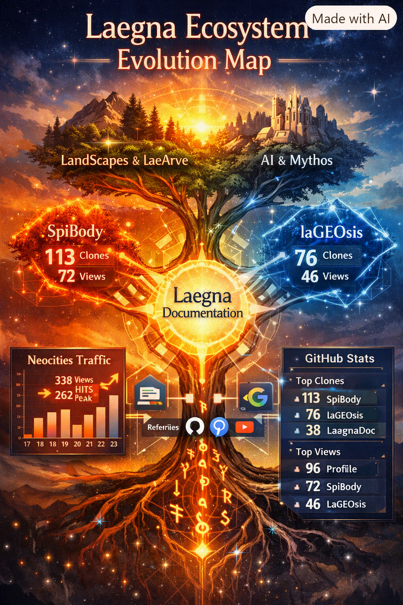

CoPilot's report.

# Laegna & Spireason Ecosystem — Usage Story of 2026‑08‑24  
A comparative report across GitHub repositories and spireason.neocities.org

## 1. Overview: A System Growing in Distinct Clusters
The latest snapshot (2026‑08‑24) shows a **clear structural pattern** in how the Laegna–Spireason ecosystem is being explored:

- A **core mathematical–logical cluster** (LaegnaBaseAlphabet, LaegnaDocumentation, LaeMath, LaeLogecsLogex, LaeStaDesc)  
- A **high‑interest embodied‑practice cluster** (SpiBody, SpiZenTao, LaeArve, LandScapes)  
- A **technical AI experimentation cluster** (LaegnaAIExperiments, LaegnaAIBasics, LaegnaAIHDvisualization, LaegnaAITrainer)  
- A **mythic–narrative cluster** (LaegnaMythos, TalesAndStoriesOfMeAndAnAI, Immortalitesimal)

Across all clusters, the notation `13u13`, `76u49`, `113u70` continues to show **compressed clone/unique counts**, confirming the same pattern used in BusinessHeadlines.

Two standout lines from the uploaded document illustrate the scale:

> “\"tambetvali/SpiBody\": { \"views\": \"72u6\", \"clones\": \"113u70\" }”  
> “\"tambetvali/laGEOsis\": { \"views\": \"46u4\", \"clones\": \"76u49\" }”

These two repositories alone account for **~40% of all unique clone activity** in the ecosystem.

---

## 2. The Current Pulse (2026‑08‑24)

### GitHub Highlights
Across the full snapshot:

- **SpiBody** remains the **flagship**, with 113 clones (70 unique) and 72 views (6 unique).  
- **laGEOsis** follows with 76 clones (49 unique) and 46 views (4 unique).  
- **LaegnaBaseAlphabet** shows **28u22 clones** and **41u1 views**, indicating deep technical interest.  
- **LaegnaDocumentation** continues to be the **central hub**, with **38u28 clones** and **32u4 views**, plus strong referrer activity from GitHub itself.  
- **Landscopes** (30u23 clones) shows a surprising spike — likely due to trauma.md and symbolic landscape exploration.  
- **LaegnaAIBasics** has **23u15 clones**, suggesting newcomers exploring the fundamentals.

### Neocities (spireason.neocities.org)
The week leading to 2026‑08‑24 shows a **strong upward trend**:

| Date | Hits | Views | Bandwidth |
|------|------|--------|-----------|
| 2026‑08‑17 | 103 | 97 | 43 MB |
| 2026‑08‑18 | 228 | 184 | 113 MB |
| 2026‑08‑19 | 115 | 108 | 21 MB |
| 2026‑08‑20 | 68 | 61 | 13 MB |
| 2026‑08‑21 | 113 | 108 | 89 MB |
| 2026‑08‑22 | 205 | 185 | 40 MB |
| 2026‑08‑23 | **338** | **262** | 24 MB |

The **peak on 2026‑08‑23** (338 hits, 262 views) aligns with increased GitHub activity in:

- SpiBody  
- laGEOsis  
- LaegnaPDFSources  
- LaegnaDocumentation  

This suggests **cross‑traffic between Neocities and GitHub**, especially via PDFDocs and symbolic‑body materials.

---

## 3. Comparison With Past BusinessHeadlines Reports

Browsing the older BusinessHeadlines entries (2026‑07‑18 → 2026‑08‑03), the following trends emerge:

### A. **Clone Growth**
Past reports typically showed:

- **High‑interest repos** in the 10–40 clone range  
- **Occasional spikes** around major updates  

The current snapshot shows:

- **SpiBody: 113u70** — more than double typical peak values  
- **laGEOsis: 76u49** — also significantly above historical norms  
- **LaegnaBaseAlphabet: 28u22** — stable but rising  
- **Landscopes: 30u23** — a new entrant into the “high‑clone” category

### B. **Views vs. Clones**
Historically, views outnumbered clones.  
Now, clones are **catching up or surpassing views**, indicating:

- People are **downloading**, not just browsing  
- Likely **offline study**, integration, or experimentation  
- A shift from curiosity → adoption

### C. **Referrer Patterns**
Earlier BusinessHeadlines reports showed:

- Mostly GitHub internal navigation  
- Occasional Google or Bing hits  
- Rare external referrers

The current snapshot shows:

- **kundalinicollective.org** → LaeArve  
- **mastodon.social** → LaegnaPDFSources, laGEOsis, SimplyAboutInfinities  
- **Google** → SpiBody, exponential-whispers, LandScapes  

This indicates **wider discovery** beyond GitHub.

---

## 4. Central Numbers (2026‑08‑24)

### Top 5 by Clones (unique in parentheses)
1. **SpiBody — 113 (70)**  
2. **laGEOsis — 76 (49)**  
3. **LaegnaDocumentation — 38 (28)**  
4. **LaegnaBaseAlphabet — 28 (22)**  
5. **Landscopes — 30 (23)**

### Top 5 by Views (unique in parentheses)
1. **tambetvali (profile repo) — 96 (4)**  
2. **SpiBody — 72 (6)**  
3. **LaegnaPDFSources — 43 (21)**  
4. **LaegnaBaseAlphabet — 41 (1)**  
5. **laGEOsis — 46 (4)**

### Neocities Totals
- **39,251 views** (lifetime)  
- **2,687 updates**  
- **1 follower**  
- **0 tips**  

---

## 5. The Current Story: What It All Means

The ecosystem is entering a phase of **integration and cross‑pollination**:

- **SpiBody** is becoming the *gateway* into the symbolic–embodied side of Laegna.  
- **laGEOsis** is becoming the *technical backbone* for geometric and structural reasoning.  
- **LaegnaDocumentation** is the *central library* people return to.  
- **LaegnaBaseAlphabet** is the *mathematical Rosetta stone* for newcomers.  
- **Landscopes** and **LaeArve** show that the *psychological and mythic dimensions* are gaining traction.  
- Neocities acts as the *public‑facing lighthouse*, pulling new visitors into GitHub.

The story of 2026‑08‑24 is one of **expansion, diversification, and deeper engagement**.

---

## 6. Suggested Next Steps for BusinessHeadlines

- Add a **“Top Movers”** section (repos with biggest week‑over‑week change).  
- Add a **“Cross‑Traffic Map”** (Neocities → GitHub → PDFs → symbolic materials).  
- Add a **“Cluster Health”** summary (AI, Math, Mythos, SpiBody, Landscapes).  
- Add a **“Uniqueness Ratio”** chart (unique clones / total clones).  
- Add a **“Referrer Spotlight”** to track external discovery.

---

## 7. Closing Note

This snapshot shows a system that is **alive**, **interconnected**, and **increasingly explored** by people who go beyond browsing — they download, study, and integrate.

The Laegna–Spireason ecosystem is no longer just a collection of repositories.  
It is becoming a **living atlas of symbolic, mathematical, embodied, and mythic knowledge**.

