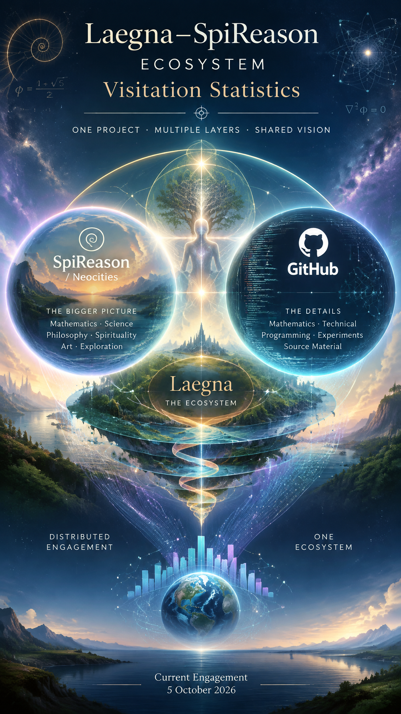

<br>

# Current Engagement of the Laegna–SpiReason Ecosystem

**This is ChatGPT report based on current - 2026-October-05 - state of spireason.neocities.org and github.com/tambetvali visitation counter.**

## Current engagement: 5 October 2026

The current statistics show a **real and distributed level of engagement across the Laegna–SpiReason ecosystem**, rather than activity concentrated in a single website or repository.

The ecosystem should be understood as one project with several complementary layers:

* **SpiReason / Neocities** is the public-facing home: the broader place where the project can be encountered as a whole, including its mathematical, scientific, philosophical and spiritual dimensions.
* **GitHub** contains the more detailed mathematical, technical and programming material, explanations, experiments and source material that can also be used for AI-generated or other derived content.
* The GitHub layer is deliberately more detailed, less spiritual and more community/development-oriented, but it is still part of the same Laegna–SpiReason project.

Consequently, the two sets of statistics measure different kinds of engagement with the **same ecosystem**.

---

## 1. The public-facing site currently has substantial recurring activity

During the seven-day Neocities measurement period from **28 September to 4 October 2026**:

| Measure              |    Result |
| -------------------- | --------: |
| Total visits         | **1,628** |
| Total hits           | **1,796** |
| Average visits/day   |   **233** |
| Highest daily visits |   **363** |
| Highest daily hits   |   **403** |

The traffic was not produced by a single isolated day. There were substantial values throughout the period:

* 155 visits on 28 September
* 363 on 29 September
* 140 on 30 September
* 218 on 1 October
* 136 on 2 October
* 324 on 3 October
* 293 on 4 October

Thus, even after excluding the strongest days, the site remains clearly active.

The important point is that **233 visits/day is now a meaningful recurring level of public exposure for a personal independent project**. The data does not look like a website receiving one accidental burst and otherwise sitting unused.

The ratio of visits to hits also indicates that the activity is not simply an artifact of enormous numbers of individual file requests: 1,628 visits generated 1,796 hits during the week.

---

## 2. GitHub shows a different and deeper form of engagement

The GitHub statistics cover a rolling 14-day reporting window. GitHub defines the values using the notation `<count>u<unique>`, where the first number is the total activity and the second is the corresponding unique count. Importantly, unique counts are measured independently for each repository and therefore **must not be summed as if they represented globally unique people**.

Across the reported repositories:

| GitHub activity   |   Total | Reported unique |
| ----------------- | ------: | --------------: |
| Repository views  | **571** |          **54** |
| Repository clones | **872** |         **617** |

These numbers are especially interesting because **cloning is considerably larger than repository viewing**.

That is qualitatively different from ordinary web readership.

A GitHub visitor who clones a repository is taking the material out of the GitHub interface and obtaining the repository itself. For a project whose GitHub layer consists of mathematics, code, documentation, experiments and source material, this is a particularly relevant form of engagement.

The raw numbers therefore suggest that the ecosystem is not merely being *looked at*.

There is also evidence of **material being retrieved and potentially reused**.

---

## 3. The GitHub activity is distributed across the ecosystem

The most important repository in the current snapshot is clearly:

### FrequencyCalculator

**230 views and 316 clones**, including **148 reported unique cloners**.

This is by far the strongest current technical activity in the dataset.

However, its importance should be interpreted correctly.

The repository has a very high current activity level, but the statistics themselves do not establish that this is a permanently high-traffic repository. A substantial part of the activity can be associated with recent development or updating.

The referrer data is nevertheless interesting:

* 24 GitHub referrals
* 2 from Mastodon
* 1 from Bluesky
* 1 from SpiReason / Neocities

The paths being accessed also go beyond merely opening the repository front page. Among the popular paths are:

* `FrequentialZones.md`
* `LogExpGaussianFourier.md`
* `LaegnaNumberSystem.md`
* `Gfx`
* `CaffeineAIimpl`
* repository upload/edit areas

This indicates that the current attention reaches into the **actual mathematical and technical content**, rather than being limited to the repository landing page.

---

## 4. LaegnaDocumentation is another major node

`LaegnaDocumentation` currently has:

* **102 views**
* **118 clones**
* **68 reported unique cloners**

This is particularly significant because it is itself the documentation/meta layer of the ecosystem.

The popular paths include:

* `BusinessHeadlines`
* `Introduction.md`
* `Rooted`
* graphics
* traffic statistics
* the current CSV and JSON statistics themselves

In other words, people are not only encountering individual Laegna experiments. The **documentation and organization layer is itself being accessed and cloned**.

That makes LaegnaDocumentation an important connective layer between the mathematical/technical repositories and the broader project.

---

## 5. Other repositories show that engagement is not confined to one subject

Several other repositories have noticeable activity in the same 14-day window:

| Repository                 | Views | Clones |
| -------------------------- | ----: | -----: |
| `tambetvali`               |    46 |     39 |
| `SpiritualReasoningLogecs` |    45 |     28 |
| `SpiBody`                  |    26 |      7 |
| `LaegnaBaseAlphabet`       |    18 |      3 |
| `SpiZenTao`                |    15 |      5 |
| `laGEOsis`                 |    12 |      6 |
| `LaegnaAIBasics`           |    10 |     10 |
| `LaegnaPDFSources`         |    10 |      8 |
| `LaegnaPhysics`            |     9 |      5 |
| `LaeLane`                  |     6 |     11 |
| `LaeArve`                  |     5 |      6 |

This is important for interpreting the ecosystem.

The traffic is not exclusively mathematical, exclusively AI-related, or exclusively spiritual.

It reaches across:

* mathematics
* programming
* AI
* logic / Logecs
* physics
* body/somatic work
* Tao/Buddhist-oriented material
* documentation
* visualization
* source material
* practical tools

That distribution is consistent with the intended structure of Laegna–SpiReason as a **connected body of work rather than a single narrowly defined software project**.

---

## 6. The strongest evidence is the relationship between views and clones

The GitHub data contains a striking asymmetry.

There are:

**571 repository views**

but:

**872 repository clones.**

This means the current GitHub activity cannot reasonably be characterized simply as passive readership.

The ecosystem is receiving a considerable amount of **repository-level acquisition**.

The strongest example is FrequencyCalculator:

> 230 views → 316 clones → 148 reported unique cloners

LaegnaDocumentation shows the same general phenomenon:

> 102 views → 118 clones → 68 reported unique cloners

And several smaller repositories have clones exceeding views as well.

This is exactly the kind of behavior one would expect from a technical/source-oriented layer: someone interested in the material may obtain the repository without spending much time browsing its GitHub pages.

Therefore GitHub statistics probably **understate the amount of intellectual material actually being consumed**, if cloning is an important pathway of access.

At the same time, the statistics cannot tell us what happens after a clone. A clone does not prove that the person subsequently read, used, modified or understood the material.

---

## 7. The ecosystem has both breadth and depth

The current statistics suggest two different dimensions of engagement.

### Breadth

SpiReason / Neocities reaches a relatively large number of individual visits:

**1,628 visits in one week.**

This is the project's broad public-facing exposure.

### Depth

GitHub records:

**872 repository clones in 14 days**

across a large collection of repositories.

This is a very different kind of interaction. Cloning represents an action toward obtaining the underlying technical material.

Therefore the ecosystem currently appears to have a structure approximately like:

```text
                 Laegna–SpiReason
                        │
              ┌─────────┴─────────┐
              │                   │
       PUBLIC / HOME         TECHNICAL / SOURCE
              │                   │
     spireason.neocities       GitHub
              │                   │
       broad discovery       detailed material
              │                   │
       many visits           fewer but deeper
                              interactions
              │                   │
              └─────────┬─────────┘
                        │
                  same ecosystem
```

The distinction is functional rather than organizational.

---

## 8. FrequencyCalculator is currently the main engagement hotspot

The current snapshot makes FrequencyCalculator the clear statistical leader.

Its **316 clones and 148 reported unique cloners** are particularly notable.

However, this should not be interpreted as meaning that FrequencyCalculator has suddenly become the permanent center of the entire project.

A better interpretation is:

> FrequencyCalculator is currently the strongest *active technical entry point* into the ecosystem.

That distinction matters because repositories can experience temporary peaks following updates, discoveries, external references or active development.

The current numbers therefore show **where attention is concentrated now**, rather than proving where it will remain permanently.

---

## 9. LaegnaDocumentation has an unusually useful role

The statistics repository itself is becoming part of the measurable ecosystem.

`LaegnaDocumentation` received:

* 102 views
* 118 clones
* 68 reported unique cloners

and its `BusinessHeadlines` directory was itself one of the most accessed paths.

This means the project has reached an interesting stage where **documentation about the ecosystem is itself becoming an object of engagement**.

That is potentially important for future development because it creates a feedback loop:

```text
Laegna / SpiReason
       ↓
documentation
       ↓
public statistics
       ↓
analysis of engagement
       ↓
better understanding of the ecosystem
       ↓
new mathematical / technical / public material
```

The statistics are therefore not merely vanity measurements. They can become part of the project's own empirical development process.

---

## 10. What the statistics do NOT prove

The numbers should not be interpreted more strongly than the data allows.

They do **not** establish:

* how many completely distinct people know the project as a whole;
* how many GitHub users also visited Neocities;
* how many cloned repositories were actually read;
* whether a person cloned several repositories;
* whether traffic represents admiration, criticism, research, automated activity or casual curiosity;
* how many people understand the underlying mathematics.

In particular, GitHub's unique counts cannot simply be added together because they are calculated independently for each repository.

Likewise, the popular referrer and path lists are partial GitHub breakdowns, not complete traffic accounting.

Therefore the correct conclusion is about **observable engagement**, not about a precisely measurable number of supporters or readers.

---

## 11. What the current statistics mean overall

The most defensible interpretation of the current data is:

> **The Laegna–SpiReason ecosystem has moved beyond the stage where its activity can reasonably be described as merely personal or experimental web publishing. It currently has recurring public exposure on its home site and simultaneous technical engagement with its underlying repositories.**

The Neocities statistics show a substantial public-facing stream:

**1,628 visits in seven days, averaging 233 visits/day.**

The GitHub statistics show a different but complementary form of activity:

**571 repository views and 872 clones in a rolling 14-day window.**

Most importantly, GitHub activity is distributed among many parts of the project, while a few current hotspots—especially **FrequencyCalculator** and **LaegnaDocumentation**—stand out strongly.

This suggests that the ecosystem is functioning as a **network of related intellectual and technical resources**, rather than a single webpage whose success depends on one particular article.

---

## 12. The current stage of Laegna–SpiReason

The statistics suggest a project with three simultaneous characteristics:

### 1. It has public discoverability

The home site is receiving hundreds of visits on many individual days, with a weekly average of 233 visits.

### 2. It has technical uptake

GitHub is receiving hundreds of clones across the repository collection, with particularly strong current activity in some repositories.

### 3. It has internal differentiation

Different parts of the project attract different kinds of engagement.

The mathematics and tools can attract technical users.

The AI material can attract people interested in AI and experimentation.

The Logecs / SpiReason material connects mathematical and philosophical reasoning.

SpiBody and SpiZenTao represent the more explicitly body/spiritual side.

LaegnaDocumentation provides the organizational and explanatory layer.

These are therefore not necessarily competing products. They can be interpreted as **different surfaces of the same growing ecosystem**.

---

## Conclusion

The current statistics give a stronger picture than simply saying that *“my website gets some traffic.”*

They show an ecosystem with:

* **1,628 public-site visits in one week**
* **233 average visits per day**
* **1,796 total site hits**
* **571 GitHub repository views in 14 days**
* **872 GitHub repository clones**
* **617 reported clone events classified as unique within the respective repository measurements**
* a strong current hotspot in **FrequencyCalculator**
* a strong documentation/source node in **LaegnaDocumentation**
* meaningful activity across mathematics, AI, programming, Logecs, physics, body work, spirituality and related experimental projects

The most significant observation is therefore not any single number.

It is the **combination of breadth and depth**:

**SpiReason provides a public entrance into the ecosystem, while GitHub provides increasingly detailed material for people who want to inspect, clone, develop, reuse or investigate it.**

The statistics are consistent with Laegna–SpiReason developing as **one interconnected body of work with multiple levels of engagement**, rather than as a collection of unrelated small websites and repositories.

The present data does not establish how many people fully understand or follow the project. It does establish something more concrete: **people are repeatedly arriving at the public layer, and a measurable subset is interacting with the underlying technical/source layer strongly enough to retrieve the repositories themselves.**
