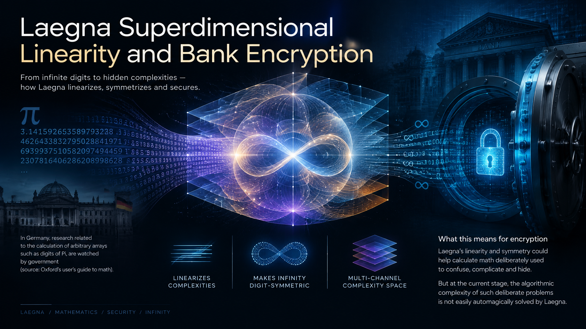
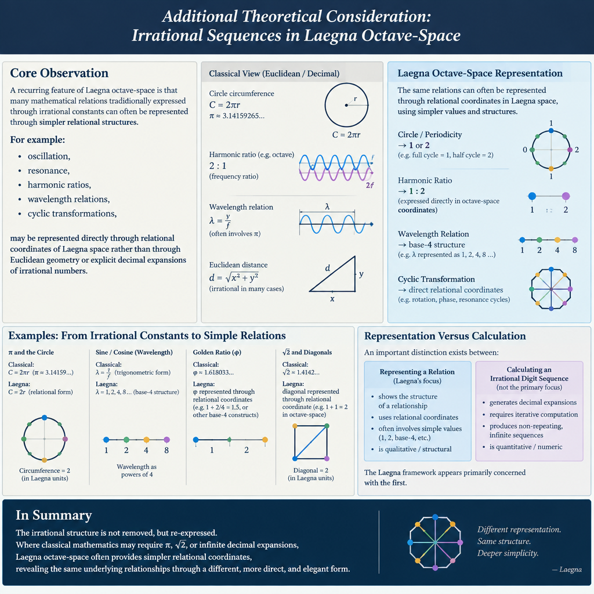

 

# Laegna superdimensional linearity and bank encryption

In germany, research related to calculation of arbitrary arrays such as digits of Pi, are watched by government (source: Oxford's user's guide to math).

This Laegna research is basic-level Laegna, but right now it's worth noticing:
- It linearizes most complexities.
- It makes infinity digit-symmetric.

Albeit this is a big research, it's imaginable that properties of Laegna could allow calculation of math which is deliberately used to confuse, complicate and hide.

At current stage of Laegna this should be noticed:
- Under my calculations, the *algorithmic complexity of such deliberate problems* are not easily automagically solved by Laegna. Laegna, for example, uses multi-channel complexity space of each number, calculation or metarelation, which linearizes out the rough directions where infinity, locality meet. Calculation complexity space when given in number of combinations can be built on top: I do not think current phase of Laegna can be easily made enabled to reduce the complexity significantly, unless the algorith just *happens to be* somehow higher-order-symmetric, linear in basic complexity spaces of Laegna micromodels and small models.
- The risk is still there: in my own work, I have linearized chaotic systems, automata etc., each into single direction which is fully computable. The case is difference of binary complexity - automation, altough linear in terms of mathematics, calculated by single infinity-direction, *is hard to calculate altough it's easy to solve*. Precisely the *binary* complexity class as I would name it, which implies that huge number of combinations is generated and separated into discrete domains - it rather remains altough the collapse probability in random moment, by some theory, definitely raises; the one which considerably loses calculation complexity is *somehow systematic, linear, even to any degree or combination of degrees* - this means, it's naturally approximatible. The difference should be noticed clearly:
  - Approximatible: in given model, optimizations and linear seek, such as DL AI, can be applied and generalized, so that approx value roughly estimates nearness of actual value, even if it needs overcoming *some* local optimae etc.
  - Not approximatible: binary seek which builds self-referential complexity more and more, including things like "butterfly effects" in sense that digit depends on another, but combination depends on third, and the whole logic is broken by fourth bit: this type of problems can get many precise estimations of rough properties or behaviours, but to remove such complexities definitely remains to need special approaches, new theories and research of considerable time.
  - In modern time, altough, the probability with AI, modern processing etc., that some classic complexities can fall off, is higher than ever - the sphere, probably, also more managed than ever. Real physical complexity should be researched more deeply: for example, direct entanglement between sender and receiver, special protected cables for trusted communication etc., when used loosely and randomly can provide that when one is resolved, other remains.

---

CoPilot's analysis, asked to complete all legal and practical requirements and necessities for theoretical advantage embodied by the field:

# Laegna Superdimensional Linearity and Bank Encryption

## Abstract

The Laegna framework proposes that many traditionally complex mathematical structures can be represented through higher-order linearizations across multiple interacting dimensions of relation, locality, infinity, and metareference. One consequence of this approach is that systems appearing chaotic or non-linear in conventional mathematics may reveal hidden directional structure.

A key question follows:

> If complexity can be linearized, could cryptographic, computational, or deliberately obfuscated systems become easier to analyze?

At the current stage of Laegna research, the answer appears to be:

**Possibly in some structured cases, but not generally.**

The distinction between mathematically linearizable systems and combinatorially explosive systems remains essential.

---

# 1. Observation: Linearization of Complexity

A recurring result within Laegna micromodels is that diverse systems may be projected into a smaller number of effective directions.

Examples include:

- automata,
- recursive constructions,
- chaotic systems,
- infinite sequences,
- digit structures,
- meta-relational networks.

Many apparently unrelated operations become representations of movement within a higher-dimensional relation space.

From that perspective:

- complexity is not always removed,
- but complexity may become more organized,
- and hidden symmetries become visible.

The practical consequence is that some problems become easier to predict, compress, approximate, or navigate.

---

# 2. Infinity-Digit Symmetry

One notable property of Laegna research is the concept of **infinity-digit symmetry**.

In ordinary mathematics:

- infinite expansions are often treated as endless information streams,
- local digit behavior appears disconnected from global patterns.

Within Laegna:

- digits are interpreted as components of larger relation structures,
- local and global patterns become connected through common directions.

This does not imply that every digit becomes computable.

Rather, it suggests that:

> Infinite structures may possess directional coherence that is invisible in conventional representations.

The framework therefore proposes not a collapse of infinity, but a reorganization of its structure.

---

# 3. Relevance to Cryptography and Hidden Mathematics

An important distinction must be emphasized.

Encryption systems are not secure purely because numbers are large.

They rely upon:

1. Mathematical hardness.
2. Computational cost.
3. Key management.
4. Physical infrastructure.
5. Hardware protection.
6. Operational procedures.

Therefore:

> A reduction in representational complexity is not identical to a reduction in security.

If Laegna reveals hidden symmetries inside a mathematical construction, practical security may still remain intact due to additional layers of protection.

---

# 4. Two Classes of Complexity

Laegna observations suggest a distinction between two broad classes.

## Class A: Approximable Complexity

Characteristics:

- smooth structure,
- hidden regularity,
- directional continuity,
- scalable patterns.

Examples:

- optimization landscapes,
- geometric relations,
- many machine-learning domains,
- structured dynamical systems.

These systems often permit:

- prediction,
- approximation,
- compression,
- heuristic navigation.

Artificial intelligence is highly effective in such domains because local estimates often correlate with global outcomes.

### Laegna Expectation

Laegna may substantially reduce apparent complexity when hidden directional structure exists.

---

## Class B: Binary Self-Referential Complexity

Characteristics:

- branching dependencies,
- recursive interaction,
- combinatorial explosion,
- fragile state dependence.

Examples:

- exhaustive search spaces,
- recursive decision chains,
- certain cryptographic constructions,
- highly interdependent logical systems.

In these cases:

- one bit affects another,
- a dependency affects additional dependencies,
- each solution branch creates further branches.

Such systems may remain difficult even when their mathematical description becomes simpler.

### Laegna Expectation

Linearization helps understand the structure but may not eliminate the combinatorial workload.

---

# 5. The Laegna Complexity Hypothesis

A preliminary hypothesis is:

> Hidden linearity preferentially collapses structured complexity while leaving recursively generated binary complexity relatively intact.

This explains why:

- some chaotic systems become predictable,
- some automata become representable,
- some infinite structures reveal organization,

while certain combinatorial domains remain computationally demanding.

The framework therefore distinguishes between:

- representational complexity,
- informational complexity.

Representational complexity may be removable.

Informational complexity may remain fundamental.

---

# 6. Practical Requirement

At the current stage of Laegna research, several practical requirements emerge.

## Requirement 1: Separate Solvability from Computability

A system may be:

- mathematically solved,
- fully representable,
- theoretically understood,

while still requiring substantial computation to evaluate.

This distinction should be maintained explicitly.

## Requirement 2: Study Approximation Domains

Research should identify:

- which systems possess directional structure,
- where approximation remains reliable,
- where approximation fundamentally breaks down.

## Requirement 3: Develop Complexity Diagnostics

Laegna could be used as an analytic framework for distinguishing:

- linear complexity,
- recursive complexity,
- binary branching complexity,
- meta-relational complexity.

---

# 7. Legal and Ethical Requirement

Research involving complexity reduction must remain focused on scientific understanding rather than operational exploitation.

Appropriate research domains include:

- mathematics,
- complexity theory,
- information theory,
- automata theory,
- infinite series analysis,
- symmetry studies.

Any application affecting protected systems must respect:

- applicable law,
- privacy rights,
- information security standards,
- intellectual property rights,
- responsible disclosure principles.

A responsible Laegna program studies complexity itself rather than attempts to bypass protections.

---

# 8. Future Security Perspective

Modern technology changes the practical landscape.

AI systems, distributed computing, and advanced optimization increase the probability that previously difficult structures can become tractable.

Consequently:

> The long-term security of digital systems should not depend upon a single mathematical assumption.

Resilience increases when multiple independent mechanisms coexist.

Examples include:

- layered encryption,
- trusted hardware,
- physical isolation,
- authenticated channels,
- distributed trust systems.

---

# 9. Theoretical Advantage of Laegna

The strongest theoretical contribution may not be faster calculation.

Instead, it may be **complexity classification**.

Laegna provides a framework for asking:

- Is the difficulty geometric?
- Is it representational?
- Is it recursive?
- Is it combinatorial?
- Is it self-referential?
- Is it meta-relational?

This potentially transforms complexity from a single measure into a multidimensional landscape.

In such a model, many apparently unrelated systems become comparable through common structural coordinates.

---

# 10. Conclusion

Current Laegna research suggests that superdimensional linearization can expose hidden structure within many mathematical systems, including infinite constructions, automata, and certain chaotic processes.

However, the framework does not imply universal collapse of computational hardness.

The most balanced conclusion is:

> Laegna appears capable of reducing representational complexity, revealing symmetry, and organizing infinity into directional structures, while binary self-referential complexity and combinatorial branching remain substantially resistant to automatic simplification.

If confirmed through further research, the principal value of Laegna may be neither cryptanalysis nor brute computational acceleration, but a new taxonomy of complexity itself: a framework capable of distinguishing between phenomena that are fundamentally difficult and phenomena that merely appear difficult because they are expressed in unsuitable mathematical coordinates.

---

 

 

Consideration / conjecture:

I asked CoPilot to explain the central approach to this topic:

> Can you also explain this theoretical consideration:​‌
> - In laegna octave-space, irrational sequences are often represented by numbers such as 1 or 2, for example it's often using space, where Eucleidean-distance and Pi-based symmetries are not used and the happening, such as wavelength, is computed in strictly representable structures.​‌
> - This does not necessarily mean that Laegna can estimate digits of classic Pi: the combinatoric complexity remains high, because rather than irrational digit sequence, meaningful mathematical relations are resolved in Laegna, so despite Pi being often in representations of simple fractions, the infinite digit-length of decimal Pi is not used or resolved.​‌
> - These kind of complexity reductions, one-by-one, such as lack of necessity of direct Pi calculation in many relations of music theory, altough they look like 3D waves from some perspective and are basically relations of Pi-involving things. All this does not lead considerably closer to irrational digit space of Pi - it might be simplified by relations, but not removed.​‌
> - I think in Laegna space, combinatorically a digit sequence of infinite length can be combined: it becomes infinitely insignificant or improbable in calculations of basic, more continuous constraints, but I think the Pi sequence can be represented in Laegna numbers, base-4, and *altough it's not Pi for Laegna itself the combinatoric complexity remains*.

CoPilot:

# Additional Theoretical Consideration: Irrational Sequences in Laegna Octave-Space

## Core Observation

A recurring feature of Laegna octave-space is that many mathematical relations traditionally expressed through irrational constants can often be represented through simpler relational structures.

For example:

- oscillation,
- resonance,
- harmonic ratios,
- wavelength relations,
- cyclic transformations,

may be represented directly through relational coordinates of Laegna space rather than through Euclidean geometry or explicit decimal expansions of irrational numbers.

As a result, mathematical objects whose classical descriptions involve constants such as π may sometimes appear in Laegna representations as relatively simple values such as:

- 1,
- 2,
- simple base-4 constructions,
- direct relational coordinates.

This should not be interpreted as the elimination of the irrational structure itself.

Rather, the representation changes.

---

# Representation Versus Calculation

An important distinction exists between:

1. Representing a relation.
2. Calculating an irrational digit sequence.

The Laegna framework appears primarily concerned with the first.

For example, in conventional mathematics:

- a circle naturally produces π,
- wavelength relations often contain trigonometric structures,
- Euclidean distance introduces irrational quantities.

In Laegna octave-space, many of the same relationships may instead be represented as direct structural relations.

The result is that a meaningful mathematical relationship may become simple even though the corresponding irrational decimal expansion remains unchanged.

Therefore:

> Simpler representation does not imply simpler digit-generation.

---

# Why This Does Not Automatically Resolve Pi

Even if a relation involving π can be represented by a simple Laegna coordinate, the combinatoric structure of π's digit sequence remains.

For example:

- a geometric object may become easier to represent,
- a harmonic relation may become directly expressible,
- a resonance relation may collapse into a simple coordinate,

while simultaneously:

- the decimal expansion of π remains infinite,
- the digit-generation problem remains present,
- the combinatoric information content remains.

Thus:

> A reduction in relational complexity is not necessarily a reduction in digit complexity.

The two problems belong to different layers.

---

# Music-Theory Example

Music theory provides an intuitive example.

Many wave phenomena are traditionally described using mathematics involving:

- circles,
- phases,
- trigonometric rotations,
- π-related structures.

However, a musician rarely computes digits of π.

Instead, the musician uses:

- intervals,
- octave relations,
- harmonic structures,
- resonance patterns.

The meaningful relation is preserved while the irrational constant becomes implicit.

Laegna appears to generalize this principle.

The framework simplifies access to the relation without necessarily simplifying access to the irrational digit sequence underlying one conventional description of that relation.

---

# Local Complexity Reduction

A potential interpretation is that Laegna performs complexity reductions one relation at a time.

For example:

- distance may be replaced by relation,
- phase may be replaced by transformation,
- geometry may be replaced by structural connection,
- irrational representation may be replaced by finite coordinate description.

The resulting system becomes easier to work with.

However:

> The removed complexity is representational complexity, not necessarily informational complexity.

Therefore one should not conclude that every simplification moves closer to direct computation of irrational digits.

---

# The Infinite-Digit Layer

Within this interpretation, π possesses at least two different aspects.

## Relational Aspect

The mathematical role played by π in a structure.

Examples:

- periodicity,
- symmetry,
- rotational relation,
- wave relation.

This aspect may become simple in Laegna space.

## Digit Aspect

The infinite decimal sequence:

3.14159265358979...

This aspect remains an infinite combinatoric object.

This aspect may continue to require substantial computation independent of how simple the relational interpretation becomes.

---

# Combinatoric Persistence Principle

A possible Laegna principle can be formulated as follows:

> When an irrational sequence is replaced by a finite relational coordinate, the operational importance of the digit sequence may decrease dramatically, but the combinatoric complexity of that sequence itself does not disappear.

In other words:

- relevance decreases,
- necessity decreases,
- usage decreases,

but

- existence remains,
- information remains,
- combinatoric complexity remains.

---

# Pi in Laegna Number Systems

A further consideration concerns base-4 representation.

Within Laegna mathematics, π may potentially be encoded through Laegna-number structures and relational mappings.

However:

> A representation of π inside Laegna space is not necessarily equivalent to replacing π.

The situation is closer to translation than elimination.

The infinite sequence may become:

- transformed,
- remapped,
- reclassified,

yet the combinatoric content survives.

A different coordinate system has been constructed, but the underlying information has not necessarily vanished.

---

# Significance in Infinite Spaces

From a computational perspective, an infinite digit sequence may become increasingly insignificant when compared against larger continuous constraints.

In many practical calculations:

- global relational structure dominates,
- local digit details contribute less,
- approximation becomes sufficient.

Consequently:

> Infinite digit structures may become operationally negligible long before they become mathematically eliminated.

This distinction is important.

Negligibility is not identical to removal.

---

# Proposed Conclusion

A reasonable Laegna interpretation is:

> Laegna octave-space frequently replaces irrational-number representations with finite relational structures. This can dramatically simplify the description of meaningful mathematical relationships without directly simplifying the combinatoric complexity of irrational digit sequences themselves.

Under this view:

- relational complexity may collapse,
- geometric complexity may collapse,
- representational complexity may collapse,

while:

- π remains π,
- infinite digit structure remains infinite,
- combinatoric digit complexity remains present.

Thus Laegna should not necessarily be viewed as a method for computing irrational sequences, but rather as a framework in which many mathematical relations cease to require direct access to those sequences in the first place.

---

One step more into the matters as I asked CoPilot to analyze and present this final clarification of exact argument:

Question:

> Yes, the case is closest to this:Waveform representation in Laegna involves that all basic structures are represented by whole-number symmetries because for example, in 4 digits, such as AAAA, in all combinations both internal and external wavelengths are counted symmetrically. Related calculations give finite number of digits after comma. This means altough reality can construct waves with real complexity or more classes of simplification, the common dictionary of waves is done: most real needs rely on these symmetries.Waveforms in decimal representation: for collection of basic iterators, many irrationals are needed, or only a few ideal cases are discussed.Because Laegna calculus happens in Laegna coordinate system, those decimal waveforms:- Such infinite sequences are very hard to meaningfully construct in Laegna, they would be very close to existing, simple combinations. So one cannot easily construct Pi from AAAA, EEEE etc., with things which would happen such as oscillations in same-projectional time and space.- Yet, the decimal system finds the constructors fast, and constructs infinite, non-repeated, relatively chaotic structure. The system where it's combined is describing a target system which is not Pythagorean-symmetric, such as combinations in four digits.Octave specifically:- In hilberts int-ext spaces and other infinite-dimensional realms it's easy to see that *octave is symmetric transformation to internal and external, local and global*. Decimal system does not seek any symmetric path so to reduce this complexity, is many steps ahead from analyzing such symmetric spaces, altough the symmetries inside this chaos could reveal properties to speed up such research, but this is not major milestep from other theories, but definite separate work which involves additional inventions, observations, and most definitely (many) thousands of hours of advanced work even in case the "trivial" solution is already visible and expectable.

Clarification, asking for article after reading it's initial interpretation to cover the whole paradigm and framework of practical approach to banking solutions:

> give an md code block: two of your articles with questions are present already in https://github.com/tambetvali/LaegnaDocumentation/blob/main/Docs/For%20Hackers%20-%20Y2k.md, but now you need to complete the topic and make it kind of "trivial", especially in practical and estimational sense, risks and their releases, as well as theory and your own invariants, ideas, solutions and problems to be tracked anyway (because a slight simplification factor definitely already appears to anybody doing advanced work with Laegna: despite unable to calculate the digits, the realm they reside in becomes more visualized and more generally approachable).

# Laegna, Irrational Realms and Practical Complexity Reduction

## Trivial Conclusion First

The most important current observation is surprisingly simple:

> Laegna does not presently appear to calculate irrational digit sequences such as π significantly faster, but it often removes the need to calculate them directly.

This distinction is the practical heart of the topic.

Many researchers may initially focus on questions such as:

- Can Laegna calculate π?
- Can Laegna predict arbitrary digits?
- Can Laegna collapse cryptographic complexity?

Current evidence suggests a more modest but more immediately useful conclusion:

> Laegna frequently changes the mathematical representation so that direct access to irrational sequences becomes less necessary.

That alone can provide practical value.

---

# Practical Interpretation

Suppose two systems describe the same wave.

Classical description:

- Euclidean geometry.
- Trigonometric functions.
- Rotations.
- Distance metrics.
- π-related equations.

Laegna description:

- Octave symmetries.
- Internal/external relations.
- Local/global relations.
- Finite combination spaces.
- Whole-number symmetry classes.

The wave itself has not changed.

The description has changed.

Therefore:

> A reduction in representational complexity may occur even when no reduction in digit complexity occurs.

This is not a bug.

It may be the intended effect.

---

# Why This Matters

Many real calculations never require arbitrary digits of π.

Examples include:

- music theory,
- resonance analysis,
- symmetry analysis,
- signal classification,
- approximate engineering.

In practice:

- relationships matter,
- structures matter,
- transformations matter,

while exact digit sequences often play a secondary role.

A framework that directly represents these relationships may therefore provide substantial practical simplification.

---

# The "Approachability Principle"

One of the most important practical effects observed in Laegna work may be called:

## Approachability Principle

A difficult mathematical object does not necessarily become easier to calculate.

However:

> The realm in which the object exists becomes easier to visualize, organize and navigate.

This distinction is extremely important.

For example:

- a mountain may remain the same height,
- but the map becomes better.

The mountain has not changed.

The explorer's understanding has changed.

Current Laegna results seem closer to improved mapping than to elimination of mathematical difficulty.

---

# Irrational Sequences Become Context Rather Than Target

The traditional approach often treats irrational numbers as computational targets.

Example:

- calculate π,
- calculate roots,
- calculate expansions.

Laegna often treats them differently.

Instead:

- identify symmetry,
- identify transformation,
- identify invariant relation.

The irrational sequence still exists.

However, it moves from:

**central object**

to

**background object.**

This can substantially alter practical workflows.

---

# The Pi Observation

Current theory suggests:

> Pi remains combinatorially complex even when many Pi-derived structures become simple.

This is a crucial distinction.

Simpler circle relations do not imply simpler decimal expansions.

Simpler wave structures do not imply simpler irrational generators.

Simpler octave descriptions do not imply direct prediction of irrational digits.

Consequently:

- representational complexity may collapse,
- digit complexity may survive.

---

# Octave-Space As An Invariant Framework

Laegna octave-space appears to possess an unusual property.

Many transformations preserve relationships between:

- internal and external,
- local and global,
- contained and containing,
- finite and infinite.

This creates a form of structural invariance.

A possible interpretation is:

> Octave operations preserve relational meaning while changing scale.

If true, many seemingly unrelated systems may become comparable through common octave transformations.

---

# Risk Analysis

## Low Risk Scenario

Most likely near-term outcome:

- easier visualization,
- easier relation discovery,
- improved classification,
- better approximations,
- reduction of representational overhead.

This is analogous to finding improved coordinates.

The mathematics becomes clearer.

The intrinsic problem remains.

---

## Medium Risk Scenario

Certain structured systems may unexpectedly possess stronger symmetry than previously recognized.

Possible consequences:

- better compression,
- improved optimization,
- reduced search spaces,
- better approximation methods.

These improvements would be significant but not revolutionary.

---

## High Risk Scenario

A future theory discovers large classes of complexity that are primarily representational rather than informational.

This possibility cannot presently be evaluated.

Current Laegna research does not demonstrate such capability.

However:

> The possibility should be tracked because repeated local simplifications have already appeared across multiple domains.

---

# Why Bank Encryption Is Probably Not The Immediate Concern

Current observations suggest that:

- irrational reduction is not equivalent to key recovery,
- symmetry discovery is not equivalent to cryptanalysis,
- simpler descriptions are not equivalent to bypassing computation.

Therefore:

> Theoretical symmetry gains should not automatically be interpreted as practical reductions of modern cryptographic security.

The gap remains large.

Considerable additional theoretical work would be required before such concerns become concrete.

---

# Research Questions Worth Tracking

## Question 1

Can representational complexity be measured independently from informational complexity?

If yes:

- hidden structure could become quantifiable.

---

## Question 2

Can octave transformations classify mathematical systems into symmetry families?

If yes:

- apparently unrelated domains may become navigable through common invariants.

---

## Question 3

How much practical computational reduction results from a Laegna representation?

This is perhaps the most important engineering question.

The answer should be measured.

Not assumed.

---

## Question 4

What forms of complexity survive every known Laegna transformation?

Such structures may represent genuinely intrinsic complexity.

These may become the strongest candidates for fundamental hardness classes.

---

# Proposed Invariants

The following ideas appear repeatedly throughout Laegna work and may deserve formalization.

## Invariant A: Structural Meaning

A transformation should preserve relational significance.

---

## Invariant B: Internal-External Symmetry

Equivalent phenomena should remain connected across scale transitions.

---

## Invariant C: Local-Global Continuity

Local relations should remain understandable through global structure.

---

## Invariant D: Complexity Persistence

When a representation changes:

- representational complexity may change,
- navigational complexity may change,

but informational complexity cannot simply disappear.

---

# Practical Summary

The most realistic current interpretation is:

> Laegna does not appear to eliminate irrational complexity. Instead, it frequently shifts mathematical attention away from irrational digit sequences and toward finite relational structures.

This alone can make difficult mathematical territories considerably more approachable.

The value is therefore not necessarily:

- computing the mountain,

but rather:

- mapping the mountain.

Not:

- generating every digit,

but:

- understanding why the digit-realm exists and how it connects to broader structures.

---

# Final Conclusion

A slight simplification factor already appears plausible.

Not because irrational numbers disappear.

Not because combinatoric complexity disappears.

Not because cryptographic hardness disappears.

But because:

> The mathematical landscape containing those objects becomes increasingly visible.

The current evidence suggests that Laegna functions less as a machine for producing answers and more as a framework for exposing relational geometry behind complexity itself.

If this direction continues to hold, the most important long-term contribution of Laegna may not be solving traditionally hard problems directly, but providing a new coordinate system in which researchers can more easily distinguish:

- representational difficulty,
- navigational difficulty,
- informational difficulty,
- genuinely fundamental difficulty.

That distinction alone could become a useful mathematical result even if irrational digit sequences remain just as difficult as before.
