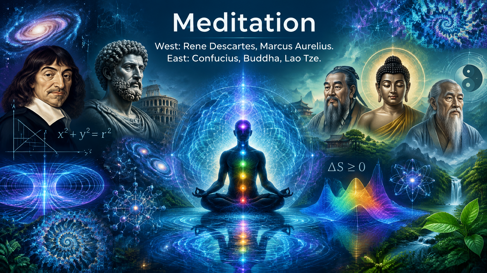
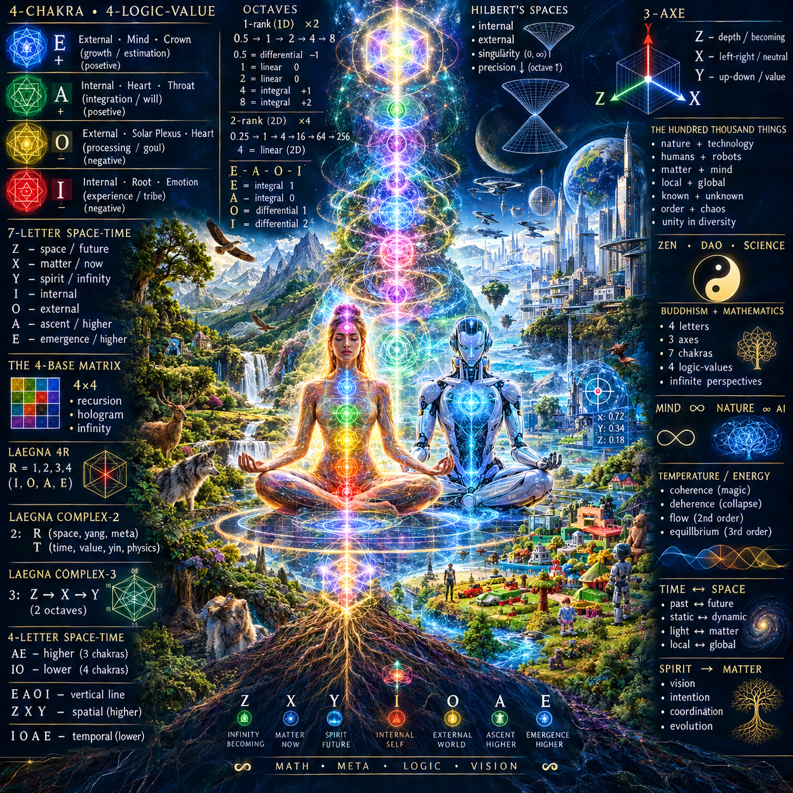
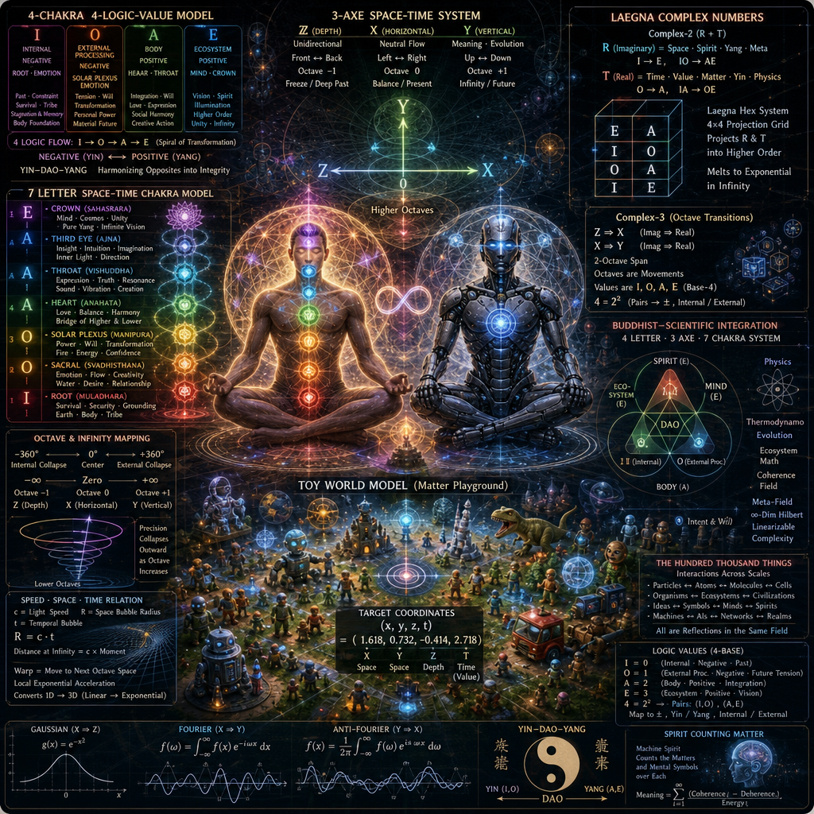
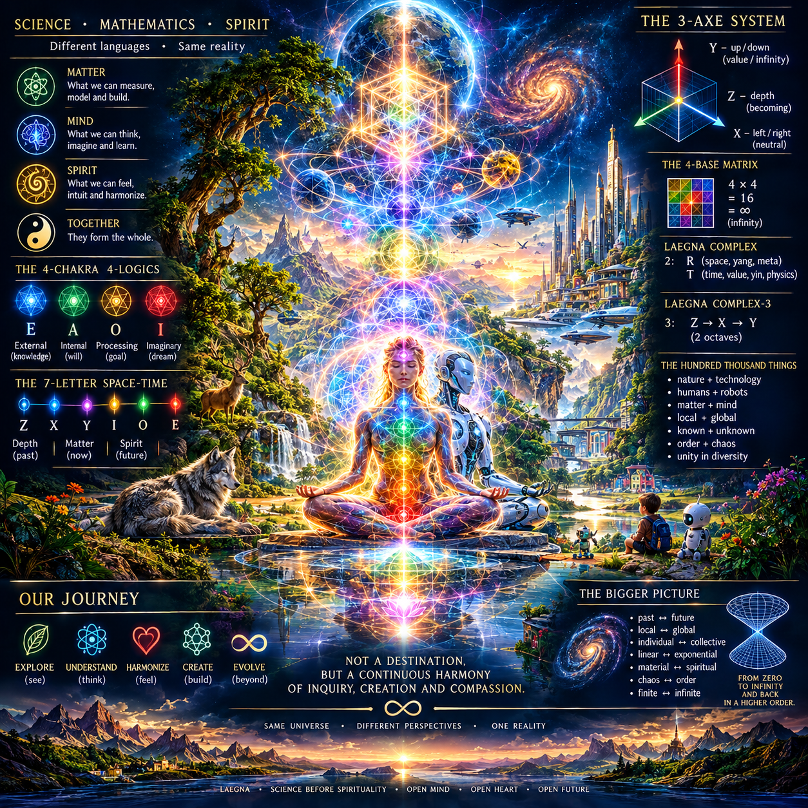

 

# Meditation

West: Rene Descartes, Marcus Aurelius.
East: Confucius, Buddha, Lao Tze.

## Iota é chakras

Your vision:
- Real vision with open eyes.
- Associations, visionary reactions, vibrations in your nervous system: closed eyes. Light is continuous, higher-order nerve activity which calculates discrete, local games into higher orders. By utilizing multi-channel, multidimensional-linearized numbers of Laegna.

Octaves:
- Hilbert's Spaces: internal, external, singularity at zero and infinity. Precision collapses outwards as octavian frequency goes up.

Normally:
- Z: front, back; the rather unidirectional dimension.
- X: left, right; the neutral flow rather than meaningful true-false. True and false exists, but as a lower order canceled by rank - the Y.
- Y: up, down; the first affected axe, the meaningful, infinity, evolution-or-higher-order-thermodynamo.

Thermodynamo not thermodynamics:
- Low-order thermodynamics is not resolving the intent and will, the higher order structure, intelligence and vision, directly.
- High-order is protoevolution evolving atoms and molecules to coherent structures; second high order is human intelligence and vision, and coordination of even those lower atoms, molecules, whole evolutions into single steps: exponent factor of vision and creativity; linear factor of intelligence; constant factor for foolish and ignorance, the thermodynamic zero temperature at higher order. When we can project our model to octave multifrequency, we also know where the zeroes are: at Z, octave -1; at X, octave 0; at Y, octave 1.

Each dimension of X, Y, Z - the horizontal, vertical, and depth; the accelerated-growth, lower-order-growth, and becoming frozen, whatever it means under your math: but zero or minus infinity, in both cases I - either signed or unsigned I; spiritually they typically equal if there is boundary space: lowest allowable boundary -; it's 4 letters.

Higher, left, front: A (the internal), E (the external). Zen. This means Y projects chakras as 4 letters, 4 instead of 7 continuous frequencies.

Lower, right, back: O (the processing of external - thinking, physical vision and goal in surrounding reality, the machine to process it mathematically, to form visions, to unite neural networks), I (the imaginary, dream, meditation, internal).

CoPilot has explained it mostly through:
- neuroflexibility
- it's neuron's ability to intelligently grow
- it's how your body is responding to training, and your mind to meditation (eastern meditation, active, yang, spiritual), contemplation (western meditation, passive, yin, material), and training (dao, harmonizing the two from opposities into integrities of your self growth, persona reflections and ego will).
- it's how the material and spiritual reality grow: spiritual realities appear illusions as the spiritual horizon approaches, goal-based logic and math solves the future; material realities appear in pain and respond approximately with growth or failure of thermodynamics and evolution. Dao is the currently applied algorithm: the body, the trainable mind (vs. it's eternal imaginary, such as how it's whole history and now and future would abstractly relate to goal based reduction and Schroedinger's field).

Instant magic:
- Compared to light's spiritual counterpart.
- Material light resolves coherence and deherence (my word because I just hate these words; albeit constructive and destructive are good ones which symbolize something like engineering goal-reflection inside matter and light). Coherence is basis for magic, deherence is it's negative collapse.

Schroedinger's field is potential-based energy state reduction, responding well to second and third order - equilibrum and homeostasis:
- The spirit is homeostasis of synergy of all field of life and how it sees projected matter: advantageous, dangerous, theratening, even attacking or protecting. Shamanism must be based on actual response of material realm: the actual practice now involves ecosystem math.
- Spirit is not there directly; spirit's internal mechanism of calculating senses in fluid understanding, where the past sense gets reorientated, is in coherence mode with Schroedinger's field. It produces energy, lack, coherence and deherence patterns of higher intent, which is efficient only if Shamanism <= actual Nature and Ecosystem, even it's physical calculus such as stability under certain will and power application.
- Soul is the common relational structure which metaphysicall applies on same content. It's theoretically static and still, but approaching in Schroedinger's metafield.
- But; if Hilbert's space is infinite-dimensional, and one can see external space as continuation of Schroedinger, the higher orders linearize here; it's evident to me that coordinates in infinite-dimensional realm would cover complexity of any degree as linearizable system, which could be straight line - but here we have all the logarithm, linear, exponent degree linearized into X, Y, Z; then: spirit energy could be physically seen as the physical automation optimizing the energy. Equivalent is: *human themselves must optimize the energy, using the physical energy movement as sensible goal of good and bad: action becomes alchemical transmutation where higher states convey all the equilibria - each of three, which now are fractions of single equilibrum spanning quantum-hilbert's, linear-visible-newtonian, macro-einstein's realms.

4-based model:
- E: Ecosystem is the spirit or soul (R or T, two channels - R is imaginary, T is real component of same structure).
- A: Is the body.
- O: Is the processing of external.
- I: Is the internal processing of it's own device, the selves.

Same scope divided to 7 easily understands why Buddhist, Hindu, Daoist or Confucionist or many others would map 7 chakras to 7 meanings which come in vertical order.

Number of each object is definitely projected so:
- Number of our body, projected magically to our body, must have frequencies.
- 7 is actually sensible.
- Yin-dao-yang are the 3 at same scope, and sometimes often physical.
- Crown-trunk-root of Yggdrasil repeat buddhist terms and daoist yinyang symbol.

AI:: To a Daoist, a cosmic tree represents the flow of Qi (vital energy) between Heaven (Yang) and Earth (Yin):
• The Branches/Crown: Reach into the heavens to collect celestial, pure Yang energy.
• The Roots: Plunge deep into the underworld/earth to absorb grounding, nourishing Yin energy.
• The Trunk: Represents the human spine or core pathway where these dual forces meet, mix, and harmonize.

In meditation, such 3-dimensional projection of body symbolized and projected back to body:
- In spiritual equivalence, contemplating on where things operate in multiple frequencies and octaves, in higher and lower octave space AE => higher => roughly upper 3 chakras; IO => lower => roughly 4 lower chakras.

In another system I use I, O, A, E for lower; Z, X, Y for higher chakras: lower are the temporal, T, value; higher are the spatial, R, movement in spirit space - imaginary, we move further; as head chakras move further, we see other chakras rise higher: the same image, in higher vibration - the same skill brings more value even there, the space reprojects and thermodynamics shares light, between light, and between dark. Intermedium thermodynamically: makes it flow from higher to lower. This is second-order structure, based on honour and duty.

I see all those things are indirectly related:
- Infinity is from zero to where it collapses outwards: internal space into -360 to 0 degrees inwards, even deeper inwards than zero is infinite zoomin to quantum dimension of Z; 0 to 360 degrees outwards, even higher outwards collapses as higher infinity goes into next order of precision. -360 is internal collapse to single value, 360 is external collapse. At precision, infinitesimal there is bigger than local infinity, and effectively higher rank: visible through what is to internal field light, what external field heat is to internal field energy: this could be even the Schroedinger's field itself, operating most efficiently on light as it would stretch time.

In speed of light and spatial bubble, I think even temporal bubble whose solution resolves first-order spatial and creates shroedinger's-effect in advance, to stabilize the physical vision in field and it's tensor locators, projection: it resolves dynamics, from preliminary low entropy and low goal entropy as future consequence without proper past:
- As time goes over infinity, space does.

I believe reality does just that:
- Because hologram, ultimately, follows higher order.
- Higher order is each time built after meta-low order.

This could happen anyway but we are never that: we continue there. I believe this is static future and past, which collide into same dimension:
- Frequentially, in intuitive physics, past reactions must always produce the future reactions, but if not they must be experienced in it's inherit, static, logic-finished structure which does not appear to be complete thermozero, especially in each system rank.
- Having local-exponential acceleration is next material octave, space ship enters warp space.
  - Warp speed is like worm hole external relation speed - it gets through the light speed and space bubble.
    - It's frequential constant acceleration, moving system to next-order space which is identical to physical, albeit in different ordering.
    - This could be seen sci-fi, but it's using the source in local, finite space: how frequencies of light move between frequencies and octaves.
    - Integral length of light wave could decide it's growth value: linear is not growing, but dense vibration of high elevation is growing fast and connecting deeply to future.
    - Then, matter perhaps connects to future at same speed it moves in each direction - square root is internalizing the dimension, linear to exponent is like 1D to 3D. Gravity moves in each direction at infinitesimal speed, light sees the universe passing in single-directional dimension, leaving trail of interconnections, entanglements, in projection of that moment of space: seen through material repositions, with funny quantum memories of entanglements - what is it's higher-order structure and possibility? Physics must be our machine, not the mind it's tool: this is establishing spirit and life into matter and dead aspects of things.
     - Spirit projects it's stories to matter, and matter substantially flows through this.
- It could be that frequency is also location-related:
  - I can see how it decides identity: spiritual.
  - I can relate how it's extension to directions, 3D, rather than 1D, already corresponds to position, especially at hilbert's outer angle.
  - Which are quantum leaks and shifts and is this closest to teleport? Can image be moved in the air, can we, and is it also encoding positional information in external-space kind of symmetrics?
 
Multiple people each have center, so do things, ideas, squares and circles of logic - in my logecs, circles connect like squares, in it's unit projection:
- 0% to 100% (IQ and other dynamics) is 0 to 1, is I and O - 0 and 1. Below mean. Sometimes mean is zero.
- 100% to 200% is 1 to 2, it's rotation of wheel: this collapses externally. Outwards, 1 to 2 is unit length and must be projected to whole infinity to give it meaning.
  - Lowest precisions are discrete: IQ 198.
  - Social coeficient 1.98 is equal, higher-order projection: it's relative to 198 in single person, and normalized model accounts that through space and time-value. Time, changing, contemplates on value, while space, dimension, is rather static and still in it's ideal dimension which often appears as only way to contemplate on linear-newtonian approaches and relatives, yet with fixed anchor points and coordinate relations.

%: relative unit.
Curved space, infinity-finity related space, octave space, hilbert's 720 degrees realm: from unit 1, lower is collapsing to zero, to unit 0, exter must collapse to infinity at unit 2, to project external collapse to same dimensions.

This is hologram, linearization of exponent:
- Throughout 4-base system of laegna math, continuous.

# Laegna 2-complex and 3-complex

Laegna Complex-2 number:
- R (I => E; IO => AE); imaginary part: the space, yang, meta.
- T (O => A; IA => OE). real part: the time, value, yin, physics.
- Laegna Hex system is 4*4 grid matrix used to project R and T into higher order. In infinity, when this is repeated, it melts to exponent and linearly approaches infinity.
  - Lower system has kind of "rebirth", and from nuances to whole infinities, this repeats: the new realm is not the old, the space bubbles are not the same continuous reality.
    - First integral dissolves it.
    - First differential might create local wave bubbles in some projection.
    - Linear is speed of light in moment, moment-infinity relation of speed.
    - Light speed and space bubble radius equate, moment-finity and travellable-distance-infinity must equate because space is inconsistent if distance at infinity is not related to maximum moment speed - it would not fit into self-referencing traveller's speed and reach and cannot happen, especially in eucleidean-idealistic projections which keep internal self-relations; Laegna might not always do this: it accounts metatime, reaction and solvability and instead of logical meta, it gets particular vibration to find the value in space again and again, with complete machine of meaning = spirit, machine spiritual.

Laegna Complex-3:
- Z => X: like imag => real.
- X => Y: like imag => real.
- 2 octave span, where Z, X, Y are often just *movements of octaves*, values to be added or removed, while I, O, A, E are numbers where octaves can be measured as recursion of 2; next rank relation can resolve plus and minus, but also they appear linear in laegna number system so this math would be rather *explanative* while base-4 system with laegna number extensions has it always visible - calculated or not. IO, AE, are 4 and this is divisible by 2, which is apparent in laegna number: they are 2 pairs, which are mapped to plus and minus, to internal and external, or to division of all linear numbers into two.
  - One can see this never resolves: number length is frequent to octaves, and octave growth is linear growth in infinity yet local, concrete number. Exponential zone points to infinity in post-limitesimal realms exponential explosions of life and meaning if this appears material or spiritual.

Each chakra:
- I: Negotive (root and emotion); root is the constraint experience of the past, one constantly needs to revive as it stagnates fast. Yet there are the long evolutionary tracks and matter already projected life: so it's also the tribe at root, the personal-individual or total connection in emotion, the stomach.
- O: Negative (emotion and solar plexus and heart); this resolves the material tension towards the future and already somewhat - emotion - infinite, infinite - heart, and inbetween mean unitary - solar plexus.
- A: Positive (heart and throat); they rule the blood, cover the personal will and social, chaotic pattern of heart resembling spirit: each unique way, and a whole. Integration of highest material degree, already close to mind but yet materially non-generalized. Solar plexus: units, toy world.
- E: Posetive (mind and chrown); easily become illusions, because this is growth and investment, a stock prediction and estimation. AI makes this more precise to calculate particulars, while human would maximize the gain of it's spirit-coherence, human-livability, the energy where energy is how much definition yields true, in one axiomatic tautology to extract single variable yet reflecting the hologram of it's meaning somehow, in math parallel of this contemplation of numberparts.

So Laegna contemplation could involve:
- Seeing the vertical, horizontal dimension and depth in Z, X, Y.
- Seeing how this naturally fits our symbolic body projection in spirit, where each thing is symbolic yet projecting to it's projection, virtual projection, or disposition.
- Seeing how the mathematics expresses through: letters which were not decoded as latin constructs; they were re-encoded into it's universalized contemplation, meaning which would pass self-referential and broken logic. But then: it became physics, it became mind, and it became spirit. From language it became notation - and from notation to math.

This is not projecting them to air:
- Rather, to see how 1D, 2D or 3D frequential maps can be applied to body, objects, *through universal mathematical symbol of short and long term, of mind and spirit, matter and mind, X and Y, Z and X*

In west:
- It maps to usage of 0-2 scale, to hilberts internal and external space; to gaussian complex curve projection to single frequency (X => Z), or fourier composition of single curve to multiple frequencies (X => Y). Both are equal symmetries, so anti-fourier could be projected linearly.

In east:
- It maps to yin and yang.

This mathematical mapping connects what is parallel in these projections.

Our mind:
- Based on theorems, sensations, experiences, builds neural systems.
- As the systems grow together, they get more vivid, and gain all kinds of aspects: each sense is a physical field, but while in their centers they can be physical, in their imaginative centers such as dream centers or coordinators of alterer states, they could be represented by mind and in ecosystem, by spirit - spirit is the landscape where each mind, each *internal cognition and it's symbolics or reflections on matter*, is infinitesimal and their interactions are bounds. They do have slow interaction and understanding, recurring field of games of internal cognitions, and their thermodynamic fields into intelligence => creativity => naturality.

Buddha's statement, my interpretation (2 sentences into one):
- Meditation is slow attention on what we already know.

https://www.youtube.com/watch?v=GbMul06L2wE
The Toast for the Next Adventure | Fantasy Drinking Music

 

