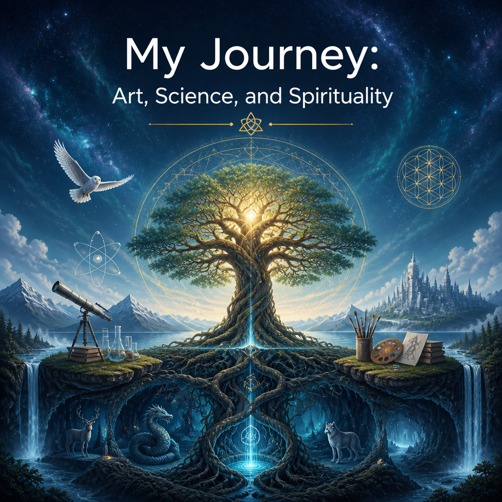

 

LinkedIn:
- Repeatedly modified my presentation so that last company I worked at, more than 10 years ago, is constantly set to beginning.
  - I fixed my account several times, but it tries to make it "complete".
- Now it's even hard to log in there, but also, google search AI is giving biased information about me in biased way:
  - LinkedIn has no right to fill any unset details about me with AI or any completion engine.
  - I have no connection with my past workspaces, moreover neither they can say anything about my work on Laegna or SpiReason, and I never connected those spiritual and scientific interests with routine programmer's/analyzt's work which is *heavily* less complicated, inside the salary of IT professional. In those companies, my bosses *would not* spend working time for any credibility or authority (author-close understanding and creation) related to any of my current work;
    - This is absolutely misleading, google-invented or linkedin-autofilled information about me, based on some kind of probabilities. Companies like logica and cybernetica or nutiteq are orientated about technology-related activities afaik and there is no confirmation about any actual prospect of those work histories or any relation about my current work, which is *my personal philosophy not permitted at workspaces, but replaced with workspace fashion and routine works where I never got any position*; AI related work here could be *slightly connected*, but it's my original independent work, and not related to 24/5 business and it's cognitive-creative abilities in realms where science, spirituality and art unite: I cannot see this work, anything "produced by me" looking down from clouds and seeking the web - for Google, to relate me to those companies, to say there is any "connection", indeed it should tell about actual products, which could be of any interest to my today: otherwise, I don't see what it means by this explanation at all.
    - Importantly, *those companies themselves do not relate themselves to me, and do not present any idea or product where I would get any income, therefore there cannot be my intellectual and creative input which is not moderated as such by laws, but already provides creditable results on their own account, verified by past history - without that, a bot cannot **relate** them to me, but only state I was doing some routine daily job, fixing some detail based on specific task, containing any detail and not creative work on my own level, but only at salary level expectations*.
   
So:
- From my website, my connections are counted. LinkedIn's automatic detail-filler and requester sorrily cannot reflect on my biography with it's fixed form: it's not innovative science and art, but competitive businessplace where one can buy eggs and potatoes or corporation-present science about your new haircare.
- From their website, one cannot find my name, any associations with products or ideas.
- If this state has been there for more than 10 years, *Google's image of me is highly misleading, related to my current websites, for all over 3 years*.
  - If you want to search about me, use bing. They have answer to some 4 questions, realistic image and relations to actual work on mine, on my own, with my own responsibility.
  - My work is not based on investors, stocks, tax system, recognition, money, any opportunity or cooperation. Nobody is allowed to say they were with me at the *actual time* I worked on this.
